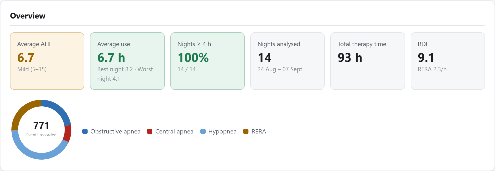
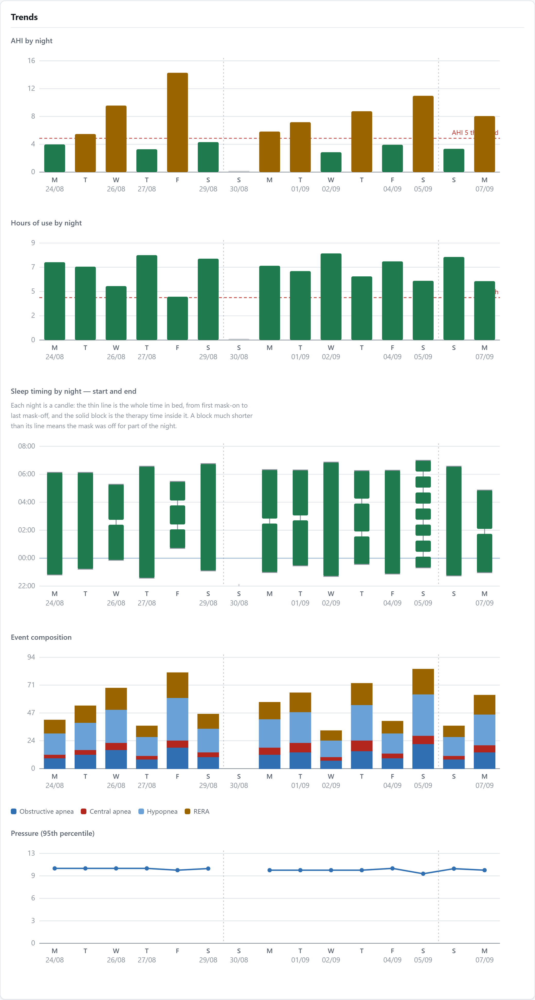
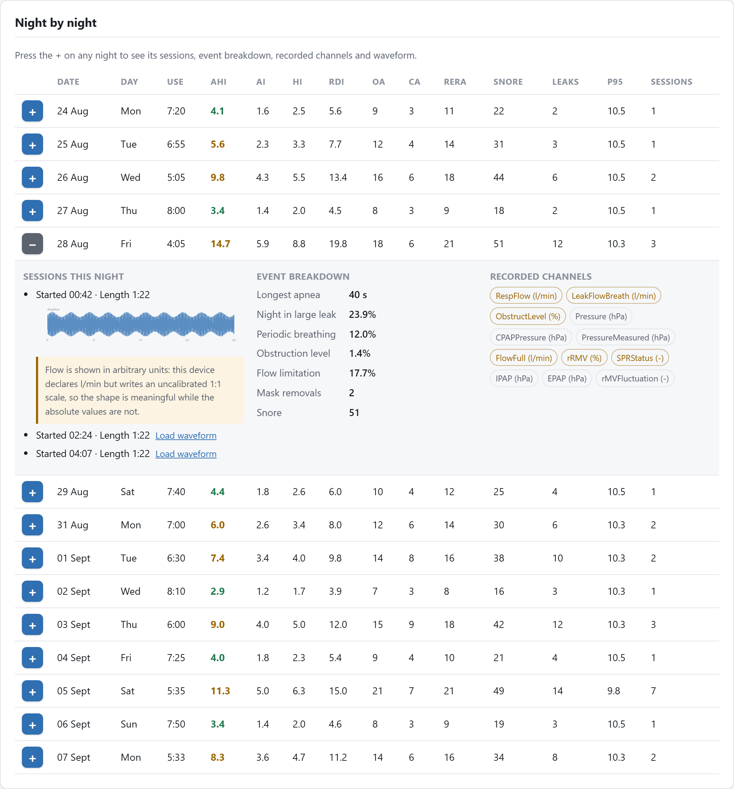
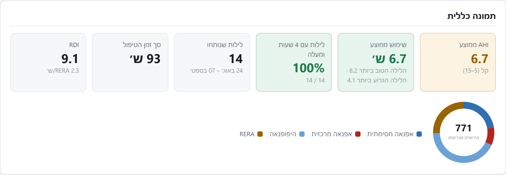
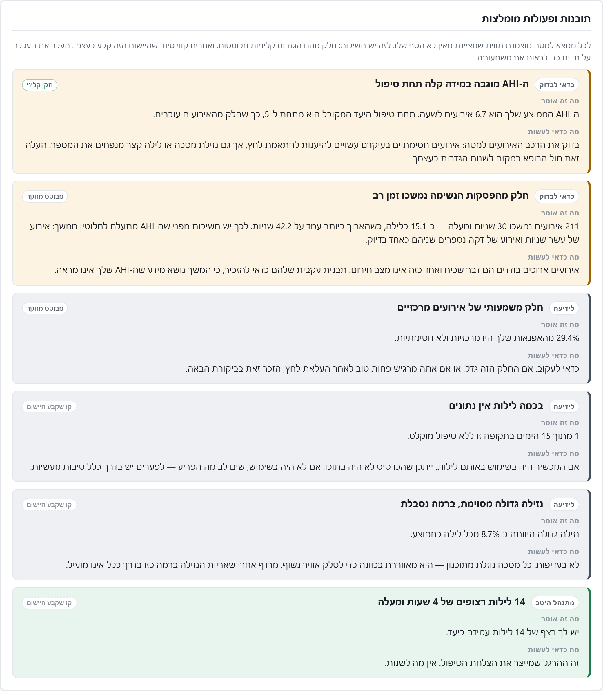
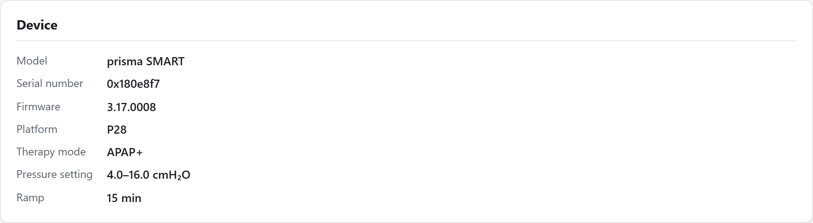
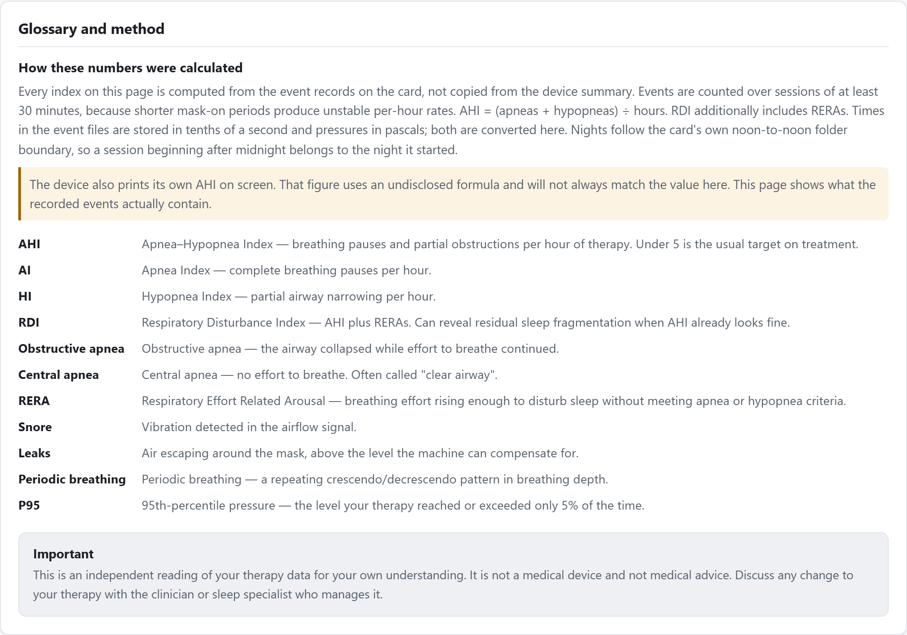
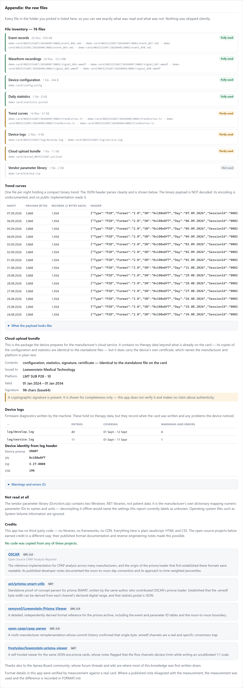

<div align="center">

# 🫁 CPAP Analyzer

**A complete therapy report from your Löwenstein prisma SD card — entirely in your browser.**

Pick a folder. Get fourteen nights of analysis, plain-language findings, and an
honest account of how every number was derived. In Hebrew and English.

[](#running-it)
[](#running-it)
[](#tests)
[](#privacy)
[](#language)

<br>

### ▶ [**Run it now**](https://zacsadan.github.io/oscar-js/)

No install, no sign-up — it opens straight into the app.
Your card is read in the browser and never uploaded.

</div>

---

## What it looks like

<div align="center">
  
</div>

Six headline figures, each colour-banded against its own benchmark, with the
event mix beside them. Nothing here is read off the device's own display — every
index is recomputed from the event records, for reasons explained in
[How the numbers are computed](#how-the-numbers-are-computed).

### Findings written for a person, not a technician

<div align="center">
  
</div>

This is the part that distinguishes the app. **39 insight rules** examine the
report and produce findings ordered by severity, each with a plain explanation
and a concrete next step.

Every finding carries a **provenance badge** saying where its threshold comes
from, because a patient reading "your snore index is high" deserves to know
whether that line comes from a scoring manual or from someone's forum post:

| Badge | Meaning |
|---|---|
| `Clinical standard` | AASM scoring manual, clinical guideline, or CMS regulation |
| `Device` | A documented manufacturer algorithm threshold |
| `Research-based` | Peer-reviewed, but not adopted into any guideline |
| `This app's own cut` | A screening line this app set itself — **not** a medical standard |

Anything in the last tier is phrased as a prompt to look, never as a finding.
Two thresholds were deliberately demoted into it after review found no clinical
basis for them — the periodic-breathing bands and the snore-index cuts — and the
periodic-breathing line was moved from 5% to 25% because the old one fired far
too readily. The insight engine also runs a **reliability gate first**, so
caveats about short nights or heavy leak appear *above* the findings they
undermine rather than buried beneath them.

#### All 39 rules

Findings are sorted by severity — <kbd>critical</kbd>, then <kbd>warning</kbd>,
<kbd>info</kbd>, <kbd>good</kbd>. Many rules are **tiered alternatives on the
same measure**, so they can never fire together: an average AHI is controlled
*or* mild *or* moderate *or* severe, and leak lands in exactly one of five
bands. A typical report surfaces six to ten findings, not thirty-nine.

Thresholds below are the literal conditions in
[`generateInsights()`](js/analysis.js); `avg` means the mean across scored
nights.

**Reliability gates** — these run first, so a caveat appears above the findings
it undermines.

| Finding | Fires when | Severity | Tier |
|---|---|---|---|
| No therapy data found | no night has any usage | critical | — |
| Some nights are too short to score reliably | any night under 2 h; warning if >30% of nights | warning / info | Clinical |
| Leak is high enough to distort the other numbers | avg leak ≥ 15% of the night | warning | Device |

**Overall AHI control** — exactly one of these four always fires.

| Finding | Fires when | Severity | Tier |
|---|---|---|---|
| Your AHI is in the normal range | avg AHI < 5 | good | Clinical |
| AHI is mildly elevated on treatment | 5 ≤ avg AHI < 15 | warning | Clinical |
| AHI remains in the moderate range | 15 ≤ avg AHI < 30 | critical | Clinical |
| AHI is high despite therapy | avg AHI ≥ 30 | critical | Clinical |

**Residual events despite a normal AHI** — the things an AHI alone hides.

| Finding | Fires when | Severity | Tier |
|---|---|---|---|
| Low AHI but frequent arousals | avg AHI < 5 **and** avg RDI ≥ 10 | warning | Clinical |
| A few nights stand out from the rest | avg AHI < 5 but some nights ≥ 5 | info | — |
| Flow limitation despite a normal AHI | avg AHI < 5 **and** flow limitation ≥ 30% of night | warning | Research |

**Central events** — one of three, gated on at least 10 apneas so a handful of
events cannot trigger alarm.

| Finding | Fires when | Severity | Tier |
|---|---|---|---|
| Most of your apneas are central, not obstructive | ≥50% central **and** central index ≥ 5/h | critical | Clinical |
| Most apneas were central, but they were few | ≥50% central, index < 5/h | info | Clinical |
| A meaningful share of central events | ≥25% central | info | Research |

**Breathing patterns**

| Finding | Fires when | Severity | Tier |
|---|---|---|---|
| Periodic breathing over much of the night | avg ≥ 25% of night | warning | App's own cut |
| Some periodic breathing detected | avg ≥ 10% of night | info | App's own cut |
| The machine flagged a Cheyne-Stokes pattern | avg CSR ≥ 10% of night | critical | Clinical |

**Adherence and usage**

| Finding | Fires when | Severity | Tier |
|---|---|---|---|
| Excellent, consistent use | ≥95% of nights at 4 h **and** avg ≥ 7 h | good | Clinical |
| Use is below the usual benchmark | <70% of nights reach 4 h | critical | Clinical |
| Nights are on the short side | avg < 6 h (and not already flagged above) | warning | App's own cut |
| Some nights have no data | any calendar day missing; warning if >20% | warning / info | — |
| Night-to-night use varies a lot | standard deviation > 1.5 h | warning | App's own cut |
| Nightly use is declining | usage trend slope < −0.1 h/night, ≥5 nights | warning | — |
| _n_ nights in a row at 4 hours or more | streak ≥ 7 nights | good | App's own cut |

**Mask and leak** — graded by the *share of the night* spent in large leak, not
by event count. Exactly one of the first four fires.

| Finding | Fires when | Severity | Tier |
|---|---|---|---|
| Large leak for much of the night | avg ≥ 30% of night | critical | Device |
| Leak is taking up a meaningful part of the night | avg ≥ 15% | warning | App's own cut |
| Some large leak, at a manageable level | avg ≥ 5% | info | App's own cut |
| Large leak was recorded | any large-leak event, avg < 5% | info | — |
| One long, continuous leak | a single leak ≥ 60 min while avg < 15% | warning | — |
| The mask comes off during the night | ≥2 mask-off events per night on average | warning | App's own cut |

**Snoring** — framed as a prompt to look; no clinical threshold exists for a
"high" snore index on therapy.

| Finding | Fires when | Severity | Tier |
|---|---|---|---|
| Frequent snoring detected | avg snore index ≥ 30/h | info | App's own cut |
| Some snoring on therapy | avg snore index ≥ 10/h | info | App's own cut |

**Pressure** — requires a readable `config.pscfg`.

| Finding | Fires when | Severity | Tier |
|---|---|---|---|
| Therapy is reaching your pressure limit | p95 within 0.3 cmH₂O of the configured max on ≥30% of nights | warning | — |
| Fixed pressure with residual events | mode is CPAP **and** avg AHI ≥ 5 | info | — |

**Event duration and timing** — information AHI throws away.

| Finding | Fires when | Severity | Tier |
|---|---|---|---|
| Some breathing pauses lasted a long time | any event ≥ 30 s; warning if ≥5 per night | warning / info | Research |
| A notably long breathing pause | longest apnea ≥ 60 s (and none ≥ 30 s counted) | info | App's own cut |
| Events cluster later in the night | ≥50% of events in the final third, ≥20 events total | info | Research |
| Your bedtimes vary widely | p10–p90 bedtime spread > 90 min, ≥7 nights | info | Research |

**Trend** — requires at least 5 scored nights.

| Finding | Fires when | Severity | Tier |
|---|---|---|---|
| AHI is trending upward | regression slope > +0.15 /night | warning | — |
| AHI is trending downward | regression slope < −0.15 /night | good | — |

Rows with `—` in the Tier column are structural or arithmetic observations
rather than threshold judgements, so they carry no provenance badge.

### Five trend charts, drawn without a chart library

<div align="center">
  
</div>

Every chart is hand-built inline SVG. Some details worth pointing out:

- **Missing nights stay missing.** 30 August has no therapy, and it renders as a
  visible gap rather than two bars sliding together to hide it.
- **Week separators** fall on Sunday boundaries, so weekly rhythms are legible.
- **The sleep-timing chart reads like a stock candle**: the thin wick is the
  whole time in bed, the solid block is therapy time inside it. A night with
  mask-off gaps shows separated blocks on one wick. The axis runs noon-to-noon
  so a night is one continuous span instead of being cut in half at midnight.
- **Time always flows left-to-right**, in both languages, matching clinical
  convention even when the rest of the page mirrors.

### Night by night, down to the waveform

<div align="center">
  
</div>

Expand any night for its sessions, an event breakdown, the channels that night
recorded, and **on-demand waveform decoding** — waveforms are never decoded
during the scan, only when you ask for one.

Note the caveat under the waveform and the amber-outlined channel chips: the app
detects per channel whether the declared unit is real, and says so where it is
not. See [The flow channels are not calibrated](#the-flow-channels-are-not-calibrated).

### Hebrew is the default, not a translation layer

<div align="center">
  
</div>

The full findings text mirrors too, including the provenance badges:

<div align="center">
  
</div>

### Device and therapy settings

Identity and configuration, with pressures converted out of the pascals the card
stores them in:

<div align="center">
  
</div>

### Glossary and method

Every term defined, and an explicit statement of how each index was computed —
so no figure on the page is a black box:

<div align="center">
  
</div>

### The appendix

A complete accounting of every file in the folder you picked, whether the report
used it, and why not when it didn't. This is what makes the report honest — a
reader can see nothing was quietly skipped:

<div align="center">
  
</div>

> [!NOTE]
> Every screenshot above is generated from **synthetic data** — a fabricated
> fortnight written by a script, with waveforms built from sine functions. No
> patient data appears anywhere in this repository.

---

## Running it

There is no build step, no package manager, and no dependencies. Open
[`index.html`](index.html) and you are running it.

To publish it, GitHub Pages hosts it for free:

1. Push this repository to GitHub.
2. **Settings → Pages → Source:** *Deploy from a branch*, branch `main`, folder **`/`** (root).
3. The app is live at `https://<user>.github.io/<repo>/`.

Then click **Choose your SD-card folder** and select the *root* of the card —
the folder containing `config.pscfg`. Sub-folders are read automatically.

The folder picker uses `showDirectoryPicker()` where available (Chrome, Edge)
and falls back to `<input webkitdirectory>` elsewhere (Firefox, Safari).
Dragging a folder onto the page also works.

### Privacy

**Everything runs as static JavaScript in the page.** There is no upload, no
server, no telemetry, and no network request of any kind — the card's contents
never leave the machine. **The app only ever reads.** Nothing is written to the
card.

```
index.html            the app
css/style.css         direction-agnostic styling (LTR + RTL)
js/parsers.js         .wmedf / event XML / .pscfg / .psstat / .tc / .pscloud / .log readers
js/analysis.js        sessions, nights, indices, insight engine
js/i18n.js            Hebrew + English strings, locale formatting
js/charts.js          inline SVG charts (no chart library)
js/scan.js            folder walking and orchestration
js/app.js             UI
js/selftest.js        83 assertions on the arithmetic that fails silently
screenshots/     the images in this README (synthetic data)
```

### Language

**Hebrew is the default.** The markup itself ships as `lang="he" dir="rtl"` with
Hebrew text, so the page is correct before any JavaScript runs — there is no
flash of English or of left-to-right layout, and it stays Hebrew even with
scripts disabled. English is one click away in the header, and that choice is
remembered in `localStorage`.

Hebrew is not given up merely because the browser reports another language.
Browsers usually advertise only the OS locale, so deferring to `Accept-Language`
would hand an English page to a reader who wants Hebrew. A browser that
explicitly asks for Hebrew (`he`, `he-IL`, or the legacy `iw`) gets it too.

The stylesheet uses CSS logical properties throughout (`margin-inline`,
`padding-inline`, `border-inline-start`), so the layout mirrors without a second
stylesheet. Numbers and dates are formatted with `Intl`.

---

## What it reports

- **Overview** — average AHI with severity band, usage, nights at 4 h or more,
  RDI, total therapy time, event-mix donut.
- **Insights and action items** — 39 rules covering residual AHI,
  central-vs-obstructive balance, periodic breathing and CSR, adherence, bedtime
  regularity, late-night event clustering, mask leak and removals, snoring,
  pressure ceiling, long events, and trends over the period.
- **Trends** — the five charts above.
- **Night by night** — a table down to per-session detail, with on-demand
  waveform decoding.
- **Glossary and method** — every term defined, and how each index was computed.
- **Appendix** — a full inventory of the picked folder, trend-curve headers, the
  cloud-upload bundle and its certificate, device logs, and credits.
- **Export** — CSV, JSON, or print/PDF.

### How the numbers are computed

Indices are computed here from the event records, **not** read from the device's
own summary. This is deliberate:

- The device prints an AHI that uses an undisclosed formula. Independent attempts
  to reproduce it have failed, so this app publishes its own documented
  definition rather than pretending to match the display.
- `statistic.psstat` fields 16/17 track hypopneas but consistently exceed the
  event-file counts, apparently including sub-threshold events. They are parsed
  and exposed but never used for scoring.

| Index | Definition |
|---|---|
| AHI | (apneas + hypopneas) ÷ hours |
| AI  | apneas ÷ hours |
| HI  | hypopneas ÷ hours |
| RDI | (apneas + hypopneas + RERAs) ÷ hours |

Sessions shorter than **30 minutes** are excluded from per-hour rates, because a
brief mask-on period yields unstable indices — but they still count toward usage
time. If *every* session on a night is short, they are used anyway rather than
reporting nothing.

Severity bands (normal / mild / moderate / severe at 5 / 15 / 30) are the
conventional **AASM diagnostic** bands. They describe untreated severity; on
therapy the usual goal is simply "under 5". They are not an OSCAR definition —
OSCAR publishes no severity thresholds.

---

## The four traps

These are the conversions that produce plausible-but-wrong numbers when they
break. Each is measured against a real card, and each has a self-test.

1. **`EndTime` and `Duration` in `event_*.xml` are deciseconds.** Reading them as
   seconds inflates every event tenfold.
2. **Pressures in `config.pscfg` are pascals.** Divide by 100 for cmH₂O. But
   *not every numeric key is a pressure* — key `21` = 15 is 15 minutes of ramp,
   not 0.15 cmH₂O.
3. **A night's length comes from the waveform file size**, not from the
   structural `231` event. On the observed firmware a 19,988-second recording
   carries `Duration="1226"` on its `231` event — matching neither seconds nor
   deciseconds. One record is one second, so
   `(fileSize − 256×(ns+1)) ÷ bytesPerRecord` is authoritative.
4. **One night folder holds many sessions**, paired by the sequence number in the
   filename (`event_047.xml` ↔ `signal_047.wmedf`), not one per directory. One
   observed night contains seven. Grouping by directory understates usage by
   hours.

### The flow channels are not calibrated

`RespFlow` and `FlowFull` declare `l/min` but map `[-32768, 32767] → [-32768,
32767]`, an identity scale. The gain is therefore 1.0 and the values are
**arbitrary units**, not litres per minute. The waveform *shape* is correct and
usable; the absolute magnitude is not.

Pressure channels map `[0, 25.5] → [0, 255]`, giving a genuine 0.1 hPa
resolution, and are correctly scaled. The app detects this per channel by
comparing the physical and digital ranges rather than trusting the declared
unit, and labels the axis accordingly.

---

## Tests

```sh
node js/selftest.js
```

**83 assertions**, all passing, covering mixed byte widths, signed byte channels,
de-interleaving, decisecond conversion, pascal conversion, event classification,
index arithmetic, short-session exclusion, the noon-to-noon day boundary, clock
handling across midnight, and degenerate inputs. All fixtures are built in
memory — no patient data in the repository.

In the browser console: `import('./js/selftest.js').then(m => m.run())`

---

## Format reference

Everything below was measured against a **prisma SMART**, `devid 0x92`, firmware
`3.17.0008` (`2024-1212-0916-KeyholeWasp`), prismaTS set version `1.10.7`,
platform code `P28`. Fourteen nights of real data, cross-validated where
possible.

Everything marked **measured** was confirmed against the card. Everything marked
**inferred** is a reasonable reading that was not independently verified — treat
it accordingly.

<details>
<summary><b>Card layout</b></summary>
<br>

```
config.pscfg                      JSON device configuration
statistic.psstat                  JSON per-day aggregates
Upload_<serial>.pscloud           cloud-upload payload
Dcm/dcm.zip                       vendor parameter-set DLLs
<serial>/                         serial in DECIMAL, zero-padded to 10 digits
  <YYYYMMDD>/                     the night
    <session>/                    e.g. 0002
      event_NNN.xml               respiratory + device events
      signal_NNN.wmedf            waveforms
      trendCurves.tc              JSON header + binary payload
  log/develop.log, service.log
0000000001/, 4294967295/          placeholder dirs — skip
System Volume Information/        OS metadata — skip
```

**Measured:** a `0000000000`-style placeholder directory coexists with the real
serial directory, so detection must walk all non-zero serial directories rather
than picking the first.

**Measured:** session numbers are **global, not per-day**, and one night folder
can hold many sessions. One observed night (`20260905`) holds seven, all in the
same `0002/` directory.

</details>

<details>
<summary><b><code>signal_NNN.wmedf</code> — Weinmann-modified EDF</b></summary>
<br>

Standard EDF: a 256-byte general header, then `ns × 256` bytes of signal headers
stored column-wise (all labels, then all transducers, …), then interleaved data
records.

| Offset | Len | Field |
|---|---|---|
| 168 | 8 | start date, `dd.mm.yy` |
| 176 | 8 | start time, `hh.mm.ss` |
| 236 | 8 | number of data records — **unreliable** |
| 244 | 8 | record duration in seconds (`1`) |
| 252 | 4 | number of signals `ns` |

### The one extension

**Measured:** each signal's 32-byte `reserved` field carries a byte-width tag:

- `#1` → **one byte per sample**
- `#2` → two bytes per sample (standard EDF)

Signedness follows `digital_min < 0`. Multi-byte samples are little-endian.

A conformant EDF reader computes `2 × Σ samplesPerRecord` for the record size,
gets 44 instead of 32 on this card, and misaligns the entire file — producing
data that decodes without error but is meaningless.

`axt/prisma-smart-utils` derives the same width from the declared digital range
(`< 256` → 1 byte). Both approaches agree on this card; the `reserved` tag is
read here because it is explicit rather than heuristic.

### Record count

**Measured:** the header declares `19988` on one file and `-1` on others, so it
cannot be trusted. The true count comes from the file size:

```
recordBytes = Σ samplesPerRecord[i] × bytesPerSample[i]
records     = (fileSize − 256 × (ns + 1)) ÷ recordBytes
```

On the validated file this divides exactly: `639616 ÷ 32 = 19988.0`, and since
one record is one second, that is a 5.55-hour session.

### Channels observed (12 on this firmware)

| Label | Unit | Bytes | Per record | Calibrated |
|---|---|---|---|---|
| `RespFlow` | l/min | 2 | 5 | **no** |
| `LeakFlowBreath` | l/min | 1 | 1 | no |
| `ObstructLevel` | % | 1 | 1 | no |
| `Pressure` | hPa | 1 | 2 | yes |
| `CPAPPressure` | hPa | 1 | 1 | yes |
| `PressureMeasured` | hPa | 1 | 2 | yes |
| `FlowFull` | l/min | 2 | 5 | **no** |
| `rRMV` | % | 1 | 1 | no |
| `SPRStatus` | – | 1 | 1 | no |
| `IPAP` | hPa | 1 | 1 | yes |
| `EPAP` | hPa | 1 | 1 | yes |
| `rMVFluctuation` | – | 1 | 1 | yes |

**Channel count varies by firmware and model** — other documentation records 18
channels including `SpO2`, `HeartFrequency`, `BreathVolume`, `RSBI` and
`TotalLeakage`. Always read `ns` from the header; never assume a count.

</details>

<details>
<summary><b><code>event_NNN.xml</code> — events and the full ID table</b></summary>
<br>

```xml
<!-- started 1788778675 -->
<RespEvent RespEventID="101" EndTime="1227" Duration="1226" Pressure="850" Strength="0"/>
<DeviceEvent DeviceEventID="0" Time="0" ParameterID="6" NewValue="2"/>
```

**Measured:** `EndTime` and `Duration` are **deciseconds**.
`start = (EndTime − Duration) / 10`.

**Measured:** `Pressure` is in **pascals**; divide by 100 for cmH₂O.

| ID | Meaning | Scoring |
|---|---|---|
| 101 | obstructive apnea | apnea |
| 102 | central apnea | apnea |
| 103 / 105 / 106 | apnea attributed to leak / high pressure / movement | — |
| 111 | obstructive hypopnea | hypopnea |
| 112 | central hypopnea | hypopnea |
| 113 | hypopnea attributed to leak | — |
| 121 | RERA | RDI only |
| 131 | snore | — |
| 141 | artifact | — |
| 151 | flow limitation | — |
| 161 | critical leak | leak |
| 171 | periodic breathing | % of night |
| 181 | CSR | % of night |
| 221 | timed breath | — |
| 231 | session duration marker | structural |
| 241 | session end | structural |
| 262 | pressure change | structural |
| 306 / 307 | mask off / on | structural |
| 330 | large leak | leak |
| 1230 / 1240 / 1241 | **validity flags (0/1)**, not index values | flag |
| 1–5, 261 | **epoch windows**, not discrete events | % of night |

**Epoch events (1–5, 261) are two-minute analysis windows**, not individual
events. Their `Duration` expresses a proportion of that window. Counting them
toward AHI is wrong; convert to a percentage of therapy time.

**IDs 1230–1238 are status flags**, not AHI/AI/HI values. Older third-party
documentation gets this wrong.

### Event 231 is not a session length

**Measured, and contradicts other documentation:** on this firmware a
19,988-second recording carries `Duration="1226"` on its `231` event. That is
neither seconds (1,226 ≠ 19,988) nor deciseconds (122.6 s). Whatever `231`
encodes, it is not the session length. **Use the waveform record count instead.**

</details>

<details>
<summary><b><code>config.pscfg</code> and <code>statistic.psstat</code></b></summary>
<br>

### `config.pscfg`

Single-line JSON. `dev` holds identity (`sn`, `devid`, `fwversion`, `fwname`,
`hwversion`); `cfg` holds numbered therapy parameters.

**Measured** pressure keys, in pascals:

| Key | Value | Meaning |
|---|---|---|
| `6` | 2 | therapy mode (0 CPAP, 1 APAP, 2 APAP+, 3 BiLevel, 4 ASV, 5 iVAPS) |
| `7` / `8` | 400 / 2000 | therapy pressure range → **4.0–20.0 cmH₂O** |
| `9` | 400 | starting / fixed pressure → 4.0 |
| `10` | 1000 | soft ceiling → 10.0 |
| `11` / `12` | 400 / 400 | narrower limit pair; equal on this card |
| `21` | 15 | ramp minutes — **not** pressure-scaled |
| `15` | 1 | humidifier |

**Inferred:** parameter IDs are platform-specific. The prisma SMART (Firefly)
platform uses small dense integers; prismaLINE (Eyra) uses a 1000-series. The
two mappings are not interchangeable.

### `statistic.psstat`

**Measured:** plain JSON, 11 KB on this card.
`{ version, dev, use, days: [ { day: {...} } ], crc }` with 19 day entries and
numeric string keys.

Field mapping established by **exact cross-validation** against event-XML counts
across all 14 nights — three fields matched on every night:

| Key | Meaning | Confidence |
|---|---|---|
| `5` | session start, unix seconds | measured |
| `6` | therapy minutes | measured |
| `18` | RERA count = XML `121` | **exact, 14/14 nights** |
| `37` | obstructive apnea = XML `101` | **exact, 14/14 nights** |
| `38` | central apnea = XML `102` | **exact, 14/14 nights** |
| `10` | 20-value histogram | inferred (pressure) |
| `21` | 33-value histogram | inferred (per-hour) |
| `16` / `17` | hypopnea counters | see below |
| `47` / `49` / `50` | lifetime cumulative counters | inferred |

**Measured:** fields `16`/`17` correlate with hypopneas but are consistently
**higher** than the XML `111`/`112` counts on every night — apparently including
sub-threshold events the event file omits. They are exposed but never used for
scoring.

This also corrects a published field map that assigns `16`→OA, `17`→OH, `18`→CA,
`19`→CH, `38`→RERA. That mapping does not hold on this firmware; the measured one
above does.

</details>

<details>
<summary><b>The day boundary, and what is not decoded</b></summary>
<br>

### Day boundary

**Measured:** the device applies a **noon-to-noon** boundary before choosing the
`YYYYMMDD` folder. A session starting at 01:00 is filed under the *previous*
calendar day.

The folder name therefore already *is* the night — trust it, and never re-derive
the night from a session timestamp. When indexing `statistic.psstat` rows (which
carry timestamps, not folder names) against nights, subtract 12 hours first, then
take the local calendar date. This shift correctly paired every stat row to its
folder across all 14 nights.

### Not decoded

- **`trendCurves.tc`** — the JSON header parses
  (`{"Type":"P28","Format":"2.0","SN":…,"Day":"07.09.2026","Offset":"0328",…}`)
  and the payload begins at the byte offset in `Offset`. The binary encoding is
  undocumented, and no public implementation decodes it.
- **`Upload_*.pscloud`** — plain JSON with four string fields: an escaped copy of
  `config.pscfg`, an escaped copy of `statistic.psstat`, a base64 ECDSA
  signature, and a PEM device certificate. The app reads the certificate's
  printable names (it is the one place the card names its manufacturer and
  platform in plain text) but **verifies nothing** and makes no trust claim.
- **`Dcm/dcm.zip`** — contains `MCC.P2_8ParameterSet.dll` and `MCC.Plugin.V3.dll`.
  The DLL is the vendor's own parameter ID → name/unit map; inspecting it offline
  would resolve the unknown `cfg` and `psstat` keys above.

The `P28` platform code in `trendCurves.tc` corresponds to the `P2_8` parameter
set named in that DLL, and pairs with `devid 0x92` (prisma SMART) on this card.
**Inferred:** `P28` is likely a platform code shared across close siblings rather
than one model.

</details>

---

## Credits

This app ships **no third-party code** — no libraries, no frameworks, no CDN.
Everything is plain JavaScript, HTML and CSS. The projects below earned credit in
a different way: their published format documentation and reverse-engineering
notes made this possible. **No code was copied from any of them.**

| Project | Licence | What it contributed |
|---|---|---|
| [OSCAR](https://gitlab.com/CrimsonNape/oscar-sql) | GPL-3.0 | The reference implementation for CPAP analysis across many manufacturers, and the origin of the prisma loader that first established these formats were readable. |
| [axt/prisma-smart-utils](https://github.com/axt/prisma-smart-utils) | MIT | Established that the `.wmedf` byte width can be derived from each channel's declared digital range, and that `statistic.psstat` is JSON. |
| [semyonf/Lowenstein-Prisma-Viewer](https://github.com/semyonf/Lowenstein-Prisma-Viewer) | GPL-3.0 | A detailed, independently derived format reference including the event and parameter ID tables and the noon-to-noon boundary. |
| [open-cpap/cpap-parser](https://gitlab.com/open-cpap/cpap-parser) | GPL-3.0 | A multi-manufacturer reimplementation whose commit history confirmed that single-byte `.wmedf` channels are a real and specific correctness trap. |
| [frostyslav/lowenstein-prisma-viewer](https://github.com/frostyslav/lowenstein-prisma-viewer) | MIT | Flagged that the flow channels declare l/min while writing an uncalibrated 1:1 scale. |

Thanks also to the Apnea Board community, whose forum threads and wiki are where
most of this knowledge was first written down.

Where a published note disagreed with the measurement, the measurement was used
and the difference is recorded above.

## Scope and licence

This reads therapy data for personal understanding. **It is not a medical device
and not medical advice.** Nothing here should be used to change therapy settings;
that is a conversation to have with a clinician.

The parsers were written from measurements of a real card and from public format
documentation — not by reading OSCAR's GPL-3.0 source — so this code carries no
copyleft obligation from it. OSCAR remains the reference implementation for the
wider device landscape and is worth using alongside this.
